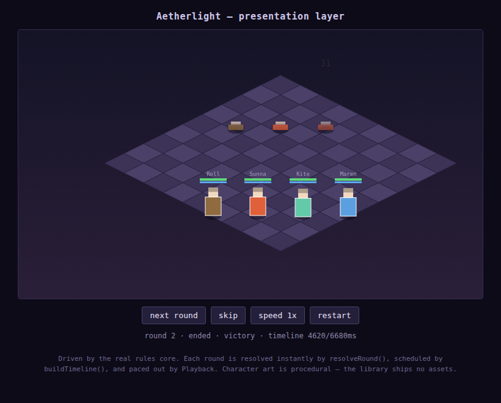

# Aetherlight Core

An engine-agnostic rules library for a classic-style elemental JRPG: bindable
elemental spirits that rewrite your class when you bind them, summons paid for
with spirits you spent earlier, and an overworld toolkit where the same
abilities that win fights also solve the map.

Zero runtime dependencies. Nothing here renders, loads assets, or reads input —
it computes rules and emits an event stream. Bind it to Godot, Unity, Unreal,
Bevy, or a browser canvas; it was built so a 2.5D / HD-2D presentation is a
first-class target.

## What this is, and what it deliberately is not

This is a **clean-room original** work: original systems, original formulas,
original content, original architecture.

It is *not* a port, decompilation, or transliteration of any existing
commercial game, and no such source was consulted in building it. Game
mechanics — elemental affinities, class systems, turn order, spirit-powered
summons — are ideas and systems, which is why a spiritual successor is possible
at all. The specific code, assets, characters, names, script, music and art of
an existing game are protected expression, and none of it is here. Keep it that
way: build your own content on top, and the project stays yours.

## Install

```bash
npm install
npm test          # 130 tests
npm run typecheck # core (DOM-free) and browser configs
npm run sim       # headless balance simulation
npm run demo      # bundle the browser demo
```

To view the demo, serve the repo over HTTP and open `demo/index.html`; ES
modules will not load from `file://`.



## Quickstart

```ts
import {
  ContentRegistry, createActorState, restore, makeMote,
  createBattle, resolveRound, enemyCommands, concludeBattle,
} from './src/index.js';
import { starterPack } from './src/data/starterPack.js';

const registry = ContentRegistry.from(starterPack);
registry.assertValid();
const ctx = registry.actorContext();

const rell = createActorState(registry.actorDef('rell')!, 12, ctx);
rell.motes = [makeMote('boulder'), makeMote('cinder')];   // -> Ashwarden
rell.equipment = { weapon: 'iron-blade', armor: 'leather-vest' };
restore(rell, ctx);

const state = createBattle({
  party: [rell],
  encounter: { id: 'road', members: [{ enemyId: 'thicket-crawler', slot: 0 }] },
  seed: 'demo',
}, registry);

while (state.phase !== 'ended') {
  const { events } = resolveRound(state, [
    { kind: 'attack', combatantId: 'party:rell', targetId: 'foe:thicket-crawler:0' },
    ...enemyCommands(state, registry),
  ], registry);
  // Hand `events` to your renderer; it decides the pacing.
}

concludeBattle(state, [rell], registry);
```

## The core ideas

**Classes are derived, never assigned.** An actor's class is a pure function of
their innate element and which elemental spirits ("motes") they currently have
bound. Bind two pyre motes to a terra-aligned character and they become
something new. Unleash one mid-battle for its effect and they may drop straight
back out of that class, losing its stat multipliers. Nothing stores the class,
so it can never desync.

**Spending is a real trade.** A mote that is `set` gives you stats and class.
Unleashing it moves it to `standby` — you get an immediate effect but lose the
bonus. Standby motes are the only currency for summons, which then send them
into `recovery` for several rounds. Every step costs something you were using.

**One toolkit, two contexts.** An art can carry a battle effect, a field
effect, or both, so the abilities that win fights are the ones that move the
boulder blocking the pass.

**Determinism throughout.** The RNG is seeded and lives inside the battle
state. Same state plus same commands equals identical results — so replays are
just a seed and a command list, netplay can send commands instead of outcomes,
and a balance bug is reproducible from its seed.

## Layout

```
src/
  core/       rng, event stream, content registry
  domain/     elements, stats, statuses, motes, classes, arts, gear, summons, actors
  battle/     damage, turn order, round resolver, setup, enemy AI
  field/      elevation grid, interactables, field abilities
  save/       versioned save files with migration
  presentation/  timeline, playback clock, 2.5D projection, canvas renderer
  data/       starter content pack (sample content; replace it)
docs/
  DESIGN.md        mechanics specification
  INTEGRATION.md   binding to an engine, porting checklist
  HD2D.md          the 2.5D presentation contract
  PRESENTATION.md  the implemented presentation layer
tools/sim.ts       headless balance simulator
demo/              runnable browser demo driving the real core
```

## Content is data

All content lives in packs merged by `ContentRegistry` in load order, later
entries overriding earlier ones by id. That gives you balance patches, mods,
localization and difficulty modes without touching the rules layer.
`registry.validate()` checks every cross-reference so a typo in an art id fails
your content test instead of a boss fight.

The included `starterPack` exists to make the library runnable and to serve as
a worked example of the data shapes. It is sample content, not a game.

## Next steps

The rules layer and the presentation layer are both complete and tested.
Building a game on top means:

- **Your own content pack** — replace `starterPack` entirely.
- **Real sprite art** — the renderer draws procedural placeholders. Swap
  `drawActor` for a sheet blit; see `docs/PRESENTATION.md`.
- **Inventory and shops** — the resolver emits an intent event for items and
  leaves the rules to you, since inventory models vary wildly between projects.
- **Map and encounter data** — the grid loads from JSON; authoring is yours.
- **Story, dialogue, quests** — intentionally absent.

## License

MIT. See `LICENSE`.
